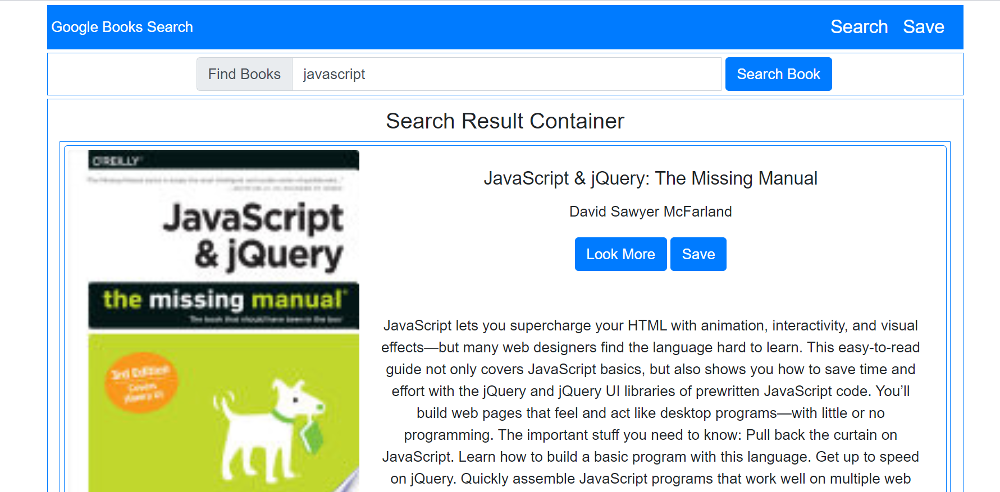
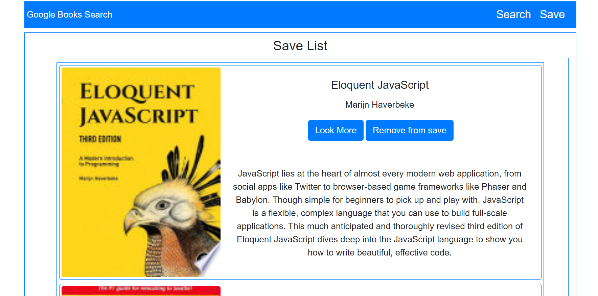
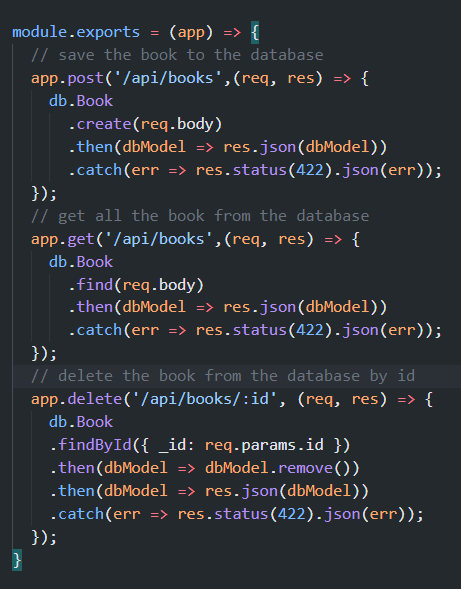

# Unit 21 Google Books Search

### Project Description

* A sample MERN stack React application that can search the book's info from Google Books, and save user's favorite books to the database
* Use MongoDb as database
* The application is deploy on Heroku

### Usage
#### Search Page

#### Save Page

#### API Router

### Leangue Ues :
``
React, MongoDB, JavaScript, Node.js, bootstrap
``

## About
* Project link: https://homework21googlebooks.herokuapp.com/
* Project Github: https://github.com/DanielYu0864/DanielYu-HomeWork-20-React-Portfolio
* Author: [`DanielYu0864`](https://github.com/DanielYu0864)

## Questions
*  For more question please contact me: adam741963@gmail.com

- - -
© 2020 - UW Coding Bootcamp Homework 21 Google Books React Search by Daniel Yu